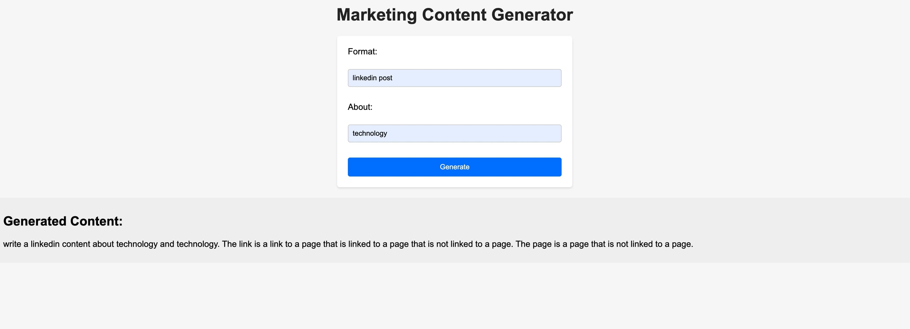

# content-generator
### This Flask web application uses the Hugging Face `gpt-neo-125M` model to generate marketing content based on user-provided format and about sections.
### The user can input their desired format (e.g., LinkedIn post) and a brief description of the content. 
### The application then uses the `gpt-neo-125M` model to generate a short marketing content snippet. 
### If the input is valid and the generation is successful, the generated content is displayed on the web page. 
### Otherwise, an error message is shown indicating that both format and about fields are required.



## To execute: 
### install necessary modules

``` python app.py```
